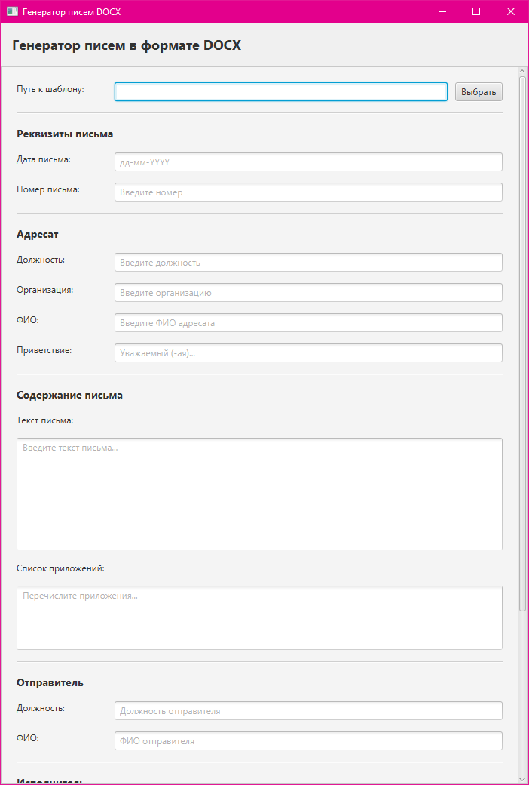
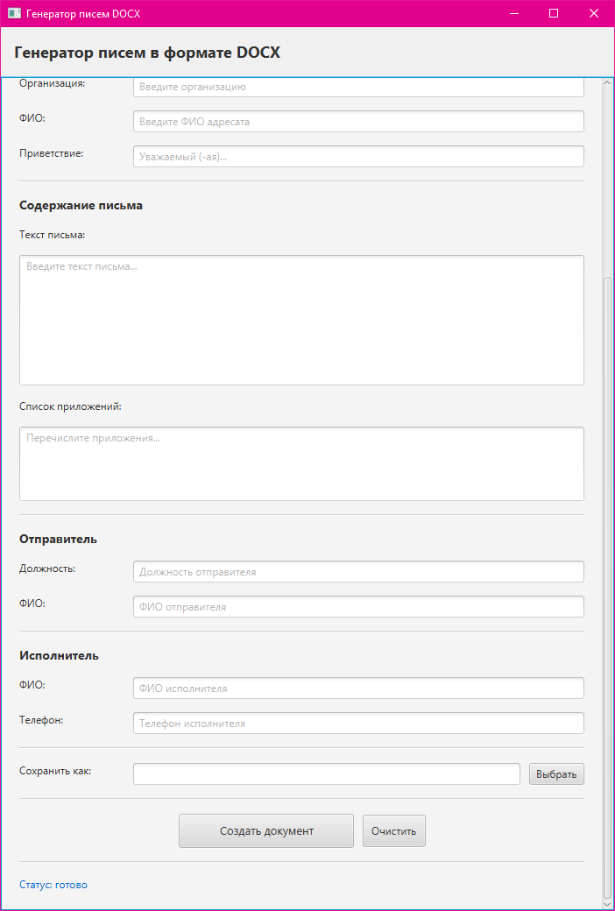
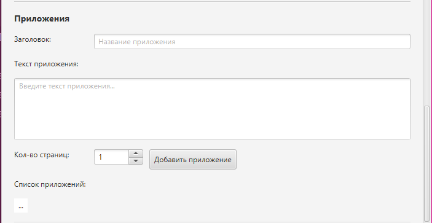
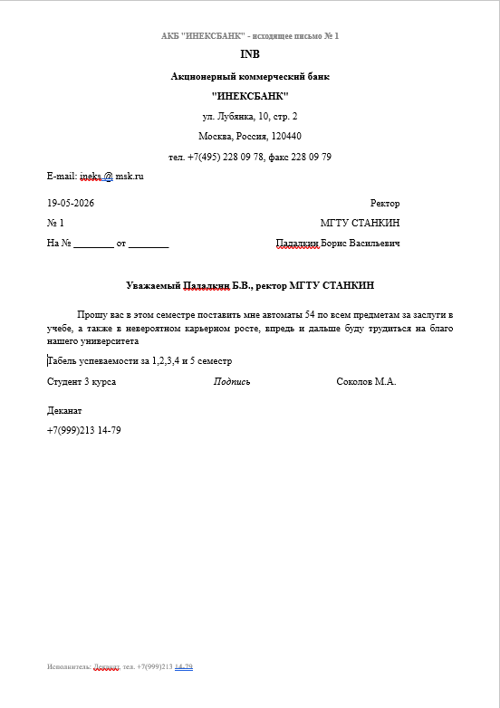
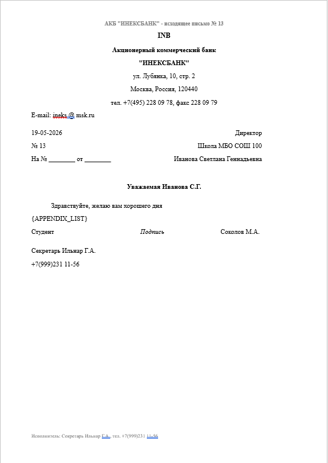
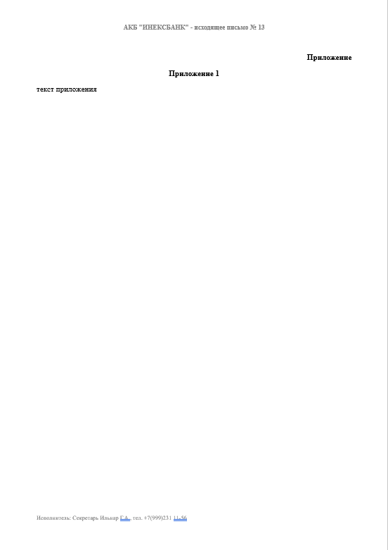

# Автоматическая генерация писем в формате DOCX

JavaFX приложение для автоматической генерации официальных писем в формате DOCX с заменой плейсхолдеров.

## Технологии

- **Java 25** — язык программирования
- **JavaFX 26.0.1** — фреймворк для UI
- **Apache POI 5.2.5** — работа с документами DOCX
- **Gradle 9.1.0** — система сборки

## Техническое задание

### Лабораторная работа 1

#### Цель работы

Познакомиться с библиотекой Apache POI и принципами работы с шаблонами DOCX для автоматической подстановки пользовательских данных в текстовые документы средствами JavaFX-приложения.

#### Задачи

1. ✅ Создать JavaFX-приложение с формой ввода данных (должность адресата, ФИО, тема письма и т.д.)
2. ✅ Подготовить шаблон документа в формате `.docx` с плейсхолдерами (`{RECIPIENT_POST}`, `{RECIPIENT_NAME}`, `{LETTER_BODY}` и т.д.)
3. ✅ Реализовать функционал замены плейсхолдеров во всех частях документа (тело, таблицы, колонтитулы)
4. ✅ Проверить корректность результата в Microsoft Word

### Лабораторная работа 2

#### Цель работы

Расширить функциональность приложения для поддержки автоматической подстановки данных о приложениях (их заголовки и тексты) в письмо с правильным форматированием.

#### Задачи

1. ✅ Реализовать автоматическую подстановку данных о приложениях в письмо
2. ✅ Добавить возможность указывать одно или несколько приложений к письму
3. ✅ Каждое приложение должно содержать:
   - Слово "Приложение" справа (если одно), или "Приложение 1", "Приложение 2" и т.д. (если несколько)
   - Заголовок приложения по центру
   - Текст приложения (произвольный контент без рисунков и картинок)
4. ✅ Добавить в интерфейс возможность управления приложениями (добавление, удаление)
5. ✅ Автоматически форматировать каждое приложение на отдельной странице

## Что было реализовано

### Основной функционал

- 📋 **Выбор шаблона** — загрузка DOCX файла через файловый браузер
- 📝 **Форма ввода данных** с полями:
  - Реквизиты письма (дата, номер)
  - Данные адресата (должность, организация, ФИО, приветствие)
  - Содержание письма (текст основной части)
  - Данные отправителя и исполнителя
- 🎯 **Автоматическая замена** всех плейсхолдеров на введённые значения
- 💾 **Сохранение результата** в новый файл DOCX
- ✔️ **Валидация** полей ввода (дата и телефон)

### Функционал работы с приложениями

- 📎 **Управление приложениями** — добавление и удаление приложений через UI
- 📄 **Каждое приложение включает**:
  - Заголовок/название приложения
  - Текстовое содержимое (неограниченный объём)
  - Количество страниц (листов)
- 📑 **Автоматическое форматирование**:
  - "Приложение" (справа) — если одно приложение
  - "Приложение 1", "Приложение 2" и т.д. — если несколько
  - Заголовок по центру
  - Текст приложения с сохранением форматирования
  - Каждое приложение на отдельной странице
- 🔄 **Интеграция с письмом** — приложения автоматически добавляются в конец документа после основного текста

### Специальные возможности

- **Форматирование даты**: `дд-мм-YYYY` (принимает любые символы, сохраняет только цифры)
- **Форматирование телефона**: `+7(999)999 99-99` (автоматическое добавление скобок и дефисов)
- **Обработка колонтитулов** — замена плейсхолдеров в верхних и нижних колонтитулах
- **Обработка таблиц** — замена плейсхолдеров внутри таблиц документа
- **Удаление приложений** — двойной клик на приложение в списке удаляет его

## Структура проекта

```
src/main/java/by/michael/
├── Main.java                    # Точка входа приложения
├── MainController.java          # Контроллер FXML
├── DocumentService.java         # Логика работы с DOCX
├── Appendix.java                # Модель данных для приложений
└── formatters/
    ├── DateFormatter.java       # Форматер даты
    └── PhoneFormatter.java      # Форматер телефона

src/main/resources/
├── main.fxml                    # FXML макет интерфейса
├── base-letter-template.docx    # Шаблон письма
└── template.png                 # Изображение шаблона
```

## Установка и запуск

### Требования

- Java 25+
- Gradle 9.1.0

### Сборка проекта

```bash
./gradlew clean build
```

### Запуск приложения

**Через Gradle:**

```bash
./gradlew run
```

**Через IDEA:**

1. Откройте файл `Main.java`
2. Нажмите зелёную стрелочку рядом с методом `main()`

## Использование

### Основной процесс

1. **Запустите приложение**
2. **Выберите шаблон** — нажмите "Выбрать" и загрузите DOCX файл с плейсхолдерами
3. **Заполните основные данные** — введите информацию о письме и адресате
4. **Добавьте приложения** (опционально):
   - Введите заголовок приложения
   - Напишите текст приложения
   - Укажите количество страниц
   - Нажмите "Добавить приложение"
   - Повторите для остальных приложений
5. **Управляйте приложениями** — двойной клик на приложение в списке удаляет его
6. **Выберите путь сохранения** — укажите, где сохранить готовый документ
7. **Нажмите "Создать документ"** — приложение создаст новый файл с заменой плейсхолдеров и добавлением приложений
8. **Откройте в Word** — проверьте результат в Microsoft Word или другом редакторе

### Примеры плейсхолдеров

```
{LETTER_DATE}              — дата письма (дд-мм-YYYY)
{LETTER_NUMBER}            — номер письма
{RECIPIENT_POST}           — должность адресата
{RECIPIENT_ORGANIZATION}   — организация адресата
{RECIPIENT_NAME}           — ФИО адресата
{GREETING}                 — приветствие
{LETTER_BODY}              — основной текст письма
{APPENDIX_LIST}            — список приложений
{SENDER_POST}              — должность подписывающего
{SENDER_NAME}              — ФИО подписывающего
{EXECUTOR_NAME}            — ФИО исполнителя
{EXECUTOR_PHONE}           — телефон исполнителя
```

## Примеры

### Форма ввода основных данных




### Управление приложениями



### Результаты

#### Документ без приложений



#### Документ с одним приложением





Документ с автоматически подставленными значениями и приложениями, готовый к печати и подписанию.
